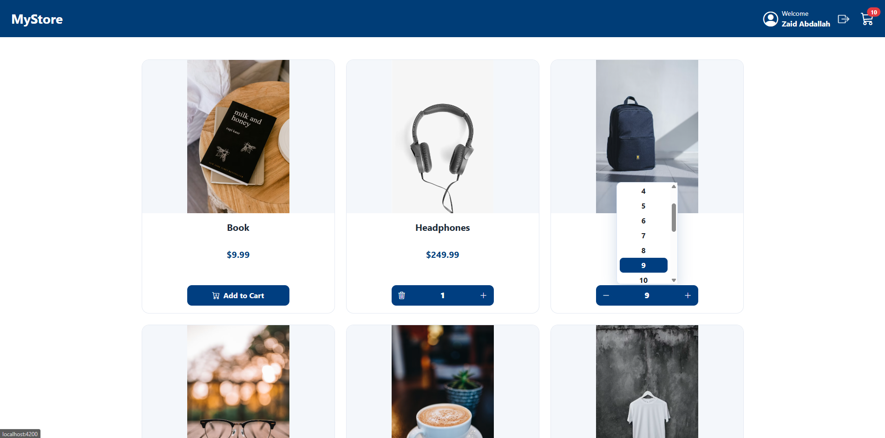
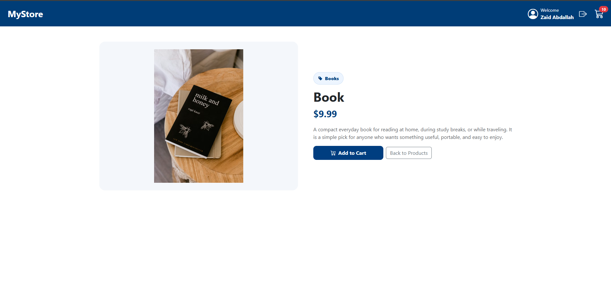
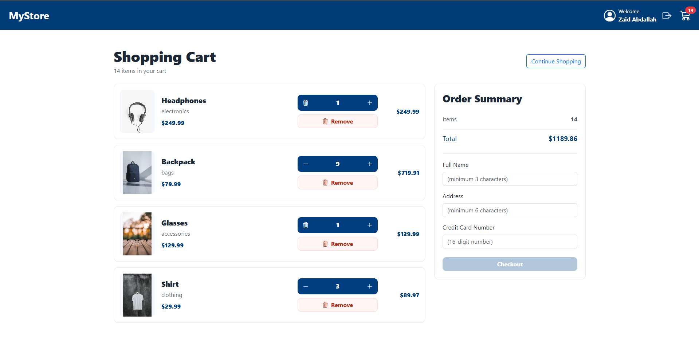
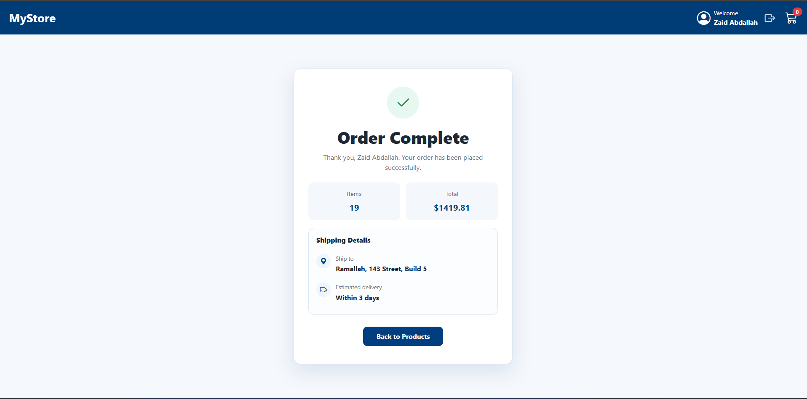
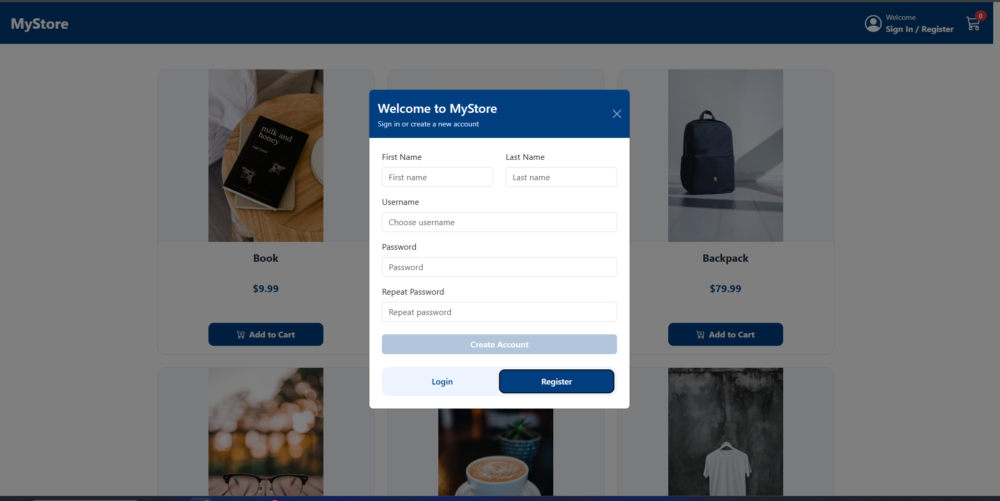
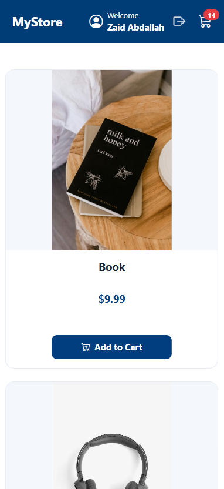

# MyStore

MyStore is a modern single-page e-commerce application built with Angular.
The application allows users to browse products, view product details, manage a shopping cart, authenticate with login/register functionality, and complete the checkout process.

This project was developed as part of the Udacity Frontend Nanodegree program.

---

# Features

* Product listing page
* Product details page
* Shopping cart with quantity management
* Checkout form with validation
* Order confirmation page
* Login & Register modal
* JWT authentication
* Responsive design for desktop and mobile devices
* REST API integration with backend services
* Shared cart state across the application

---

# Technologies Used

* Angular 21
* TypeScript
* Bootstrap 5
* ng-bootstrap
* Angular Router
* Angular Forms
* Angular HttpClient
* Angular Signals (used selectively for cleaner state management)
* RxJS

> Note:
> Although the Udacity course was originally based on Angular 12 concepts, this project was implemented using Angular 21 while still following the same core architecture and patterns from the course, including:
>
> * Non-standalone components
> * Services
> * Routing
> * ngModel forms
> * @Input / @Output
> * EventEmitter
> * Component hierarchy
>
> Angular Signals were used in some areas to improve maintainability and state management.

---

# Backend API

This frontend application depends on the following backend API project:

[udacity-storefront-backend](https://github.com/zaidabdllah/udacity-storefront-backend)

Please follow the backend repository setup instructions before running the frontend application. By default, this frontend expects the backend API to be running at:

```text
http://localhost:3000
```

The API base URL is configured inside the Angular environment files.

---

# Getting Started

## Prerequisites

Make sure the following are installed before starting the project:

* Node.js 20 or newer
* npm 10 or newer
* The backend API project running locally

## Install Dependencies

```bash
npm install
```

---

## Run the Application

```bash
npm start
```

The application will run on:

```text
http://localhost:4200
```

---

# Environment Configuration

The backend API URL is configured in:

```text
src/environments/environment.ts
```

Example:

```ts
export const environment = {
  production: true,
  Backend_apiUrl: 'http://localhost:3000'
};
```

---

# Main Routes

| Route           | Description        |
| --------------- | ------------------ |
| `/`             | Product list       |
| `/products/:id` | Product details    |
| `/cart`         | Shopping cart      |
| `/success`      | Order confirmation |

---

# Project Structure

```text
src/app
│
├── components
├── services
├── guards
├── environments
└── app-routing
```

---

## Product List



---

## Product Details



---

## Shopping Cart



---

## Order Success Page



---

## Login / Register Modal



---

## Mobile Responsive Design

